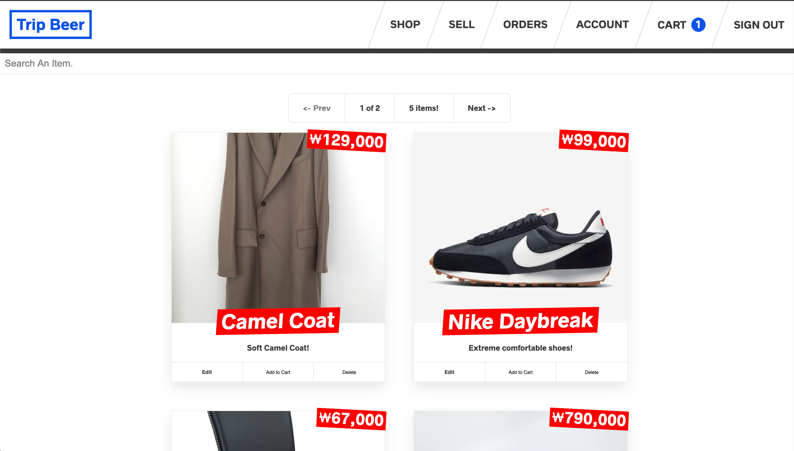
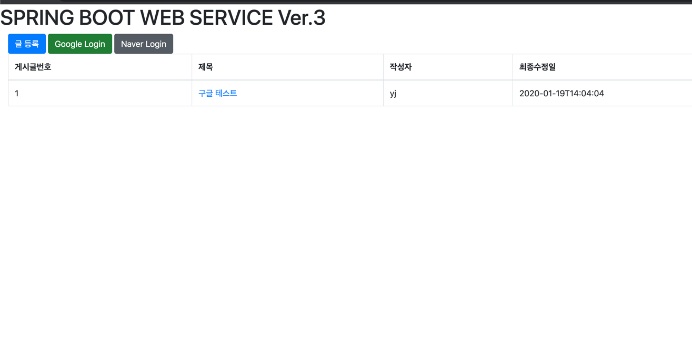

### Stack

저는 Javascript로 개발하는 것을 좋아합니다.
요즘에는 주로 React, Typescript, express를 사용해서 개발합니다.  
이 외에도 사용해본 기술로는 Next.js, Redux, GraphQL, Spring Boot, Gatsby 등이 있고  
React, Typescript, express, Next.js, Redux를 사용하는 것에는 조금 더 자신있어요.
강의와 책, 블로그 등 배우는 것을 좋아하고 결과물도 만들어봤어요.

사용하는 개발환경은 VS Code, Intellij 입니다.

공개된 소스코드는 [github](https://github.com/youngvform/) 에 올라가 있어요.
(아래 vshop과 trip-beer는 무료 호스팅이라 기동되는데 시간이 필요합니다. 천천히 기다려주세요.)

#### [vshop](https://vshop-frontend.herokuapp.com/)

> vshop은 데모 의류 쇼핑몰로 자켓, 신발, 모자 등 다양한 의류를 판매하는 사이트입니다.  
> 결제도 가능하지만 개발용이라 실제로 청구가 되지는 않아요.  
> firebase를 통해서 구글 로그인 연동을 했습니다.
> vshop에서는 React, Redux, Redux Saga, Express 사용했어요.  
> 이 프로젝트를 통해서 redux에 관한 것을 배웠어요!  
> redux saga, reselect, redux-logger 등 redux를 효율적으로 사용하는 방법을 배웠고  
> redux를 사용해서 서버와 통신하고 받은 데이터를 관리하는 방법을 배웠어요!  
> Udemy의 React 강의를 통해서 프로젝트를 완성할 수 있었어요.

#### [trip-beer](https://frontend.vformu.now.sh)

> trip-beer 프로젝트도 의류 쇼핑몰입니다.  
> vshop과 다른 점은 화면 상단에 진행률을 표시해주는 프로그레스바 기능이 있고  
> 직접 물건을 올리는 기능과 주문 내역, 자동완성 같이 디테일한 기능이 가능해요.  
> 이번에도 결제는 stripe를 사용했고 실제 청구는 되지 않아요.
> trip-beer에서는 React, Next.js, GraphQL, Apollo Client가 사용되었습니다.  
> 이 프로젝트에서는 GraphQL, Next.js, CSS를 배웠어요!  
> GraphQL를 처음 사용하면서 RestAPI 보다 좀 더 유연한 개발을 할 수 있었어요.  
> 그리고 처음으로 Next.js를 배웠고 CSS로 flex, grid를 배웠고 덕분에 flex에는 조금 자신감을 있어요!  
> GraphQL은 최근에 사용하지 않아 많은 부분이 기억나지 않지만 그래도 아직 개념은 남아있어요  
> 이 프로젝트는 wesbos의 강의를 통해서 만들었어요.  
> 이 강의가 곧 리뉴얼 되면 다시 만들어볼 생각이에요 그래서 이번엔 좀 더 깊게 GraphQL를 배울꺼에요!

#### [Spring Boot WebService](http://ec2-54-180-117-114.ap-northeast-2.compute.amazonaws.com)

> Spring Boot WebService 프로젝트는 Spring boot를 통해서 만든 게시판이에요  
> 이 프로젝트에서는 네이버와 구글 OAuth를 사용해서 로그인 연동을 했어요.  
> 게시판과 관련된 CRUD는 JPA를 사용해서 구현했어요  
> 배포는 AWS를 사용해서 배포했고 Travis를 통해서 배포 자동화를 했어요
> Spring Boot WebService에서는 Spring Boot, JPA, AWS(EC2, S3, Code Deploy), Goole OAuth, Naver OAuth가 사용되었습니다.  
> 이 프로젝트에서는 Spring boot와 JPA, AWS 등 다양한 것을 배웠어요!  
> Spring Framework는 사용해봤지만 Spring boot는 처음으로 사용해봤고 MyBatis가 아니라 JPA를 통해서 기능 구현도 처음 해봤어요  
> AWS도 이 프로젝트를 통해서 처음 사용해봤어요 덕분에 EC2, S3 같은 개념을 조금 알게 되었어요!  
> 이 프로젝트는 스프링 부트와 AWS로 혼자 구현하는 웹 서비스 책을 보고 만들었어요.
